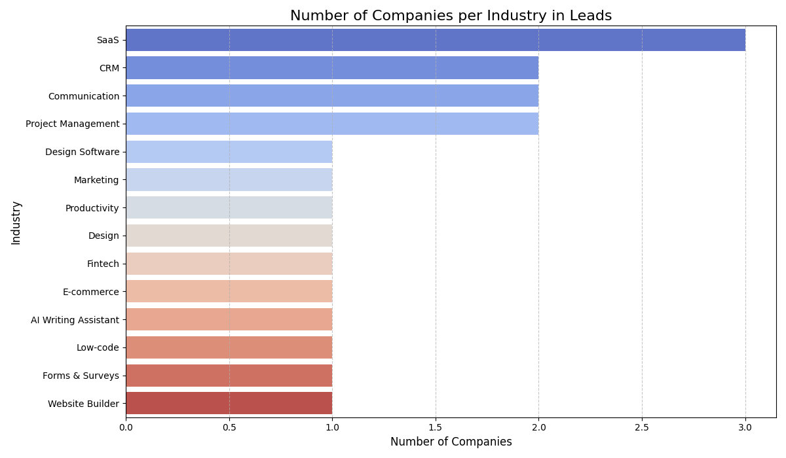
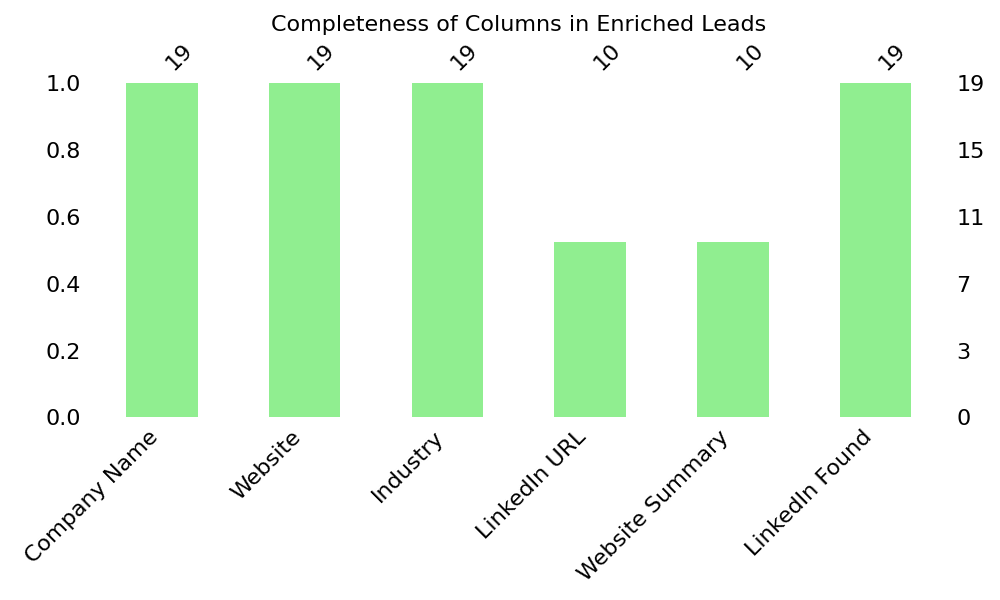
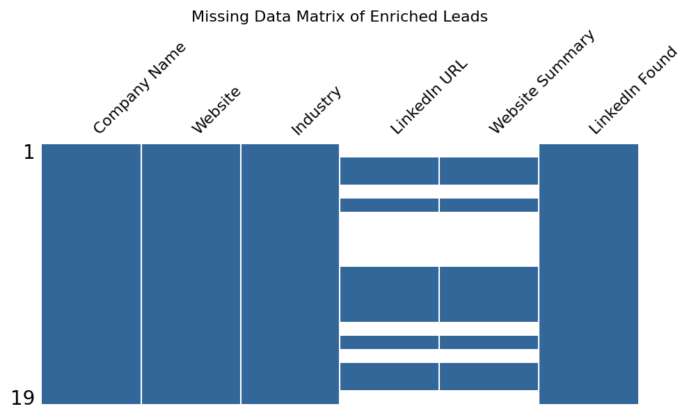
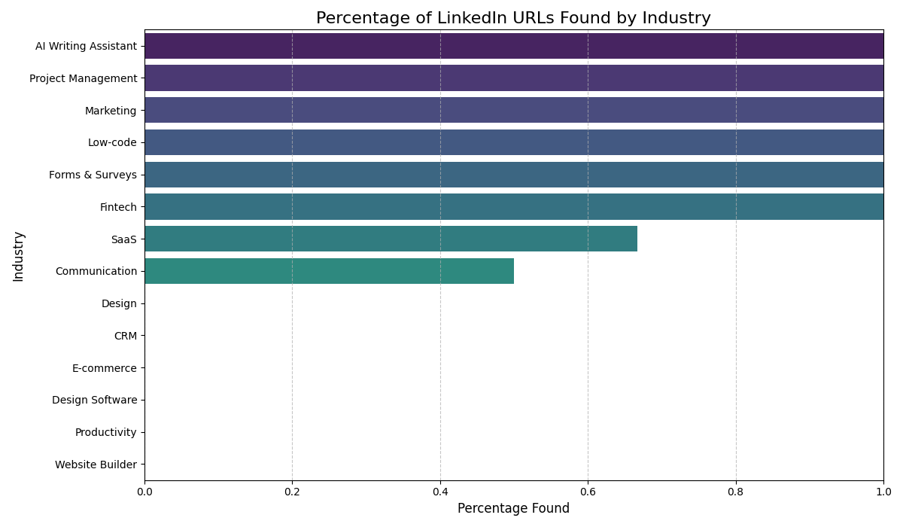
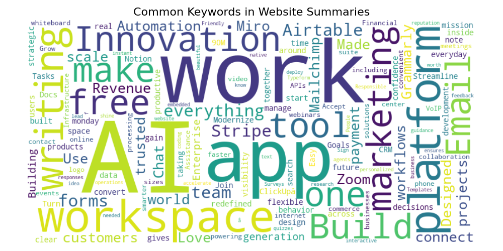

## Analysis: SaaSquatch Leads Business Model & Strategic Enhancement Rationale

**Analysis Title:** Strategic Analysis for Lead Generation Enhancement

**Submission Date:** July 13, 2025

---

### 1. Introduction: Analyzing for Impact

This analysis delves into the existing business model of SaaSquatch Leads, the lead generation tool presented by Caprae Capital. The objective is to identify its core functionalities, understand its limitations, and propose strategic enhancements that align with Caprae Capital's unique M&A as a Service (MaaS) and "Bleed and Build" philosophy, particularly their emphasis on AI-driven value creation post-acquisition. The proposed solution aims to deliver the most effective impact with just 5 hours of coding effort.

### 2. Analysis of SaaSquatch Leads Business Model

SaaSquatch Leads operates as a foundational lead generation platform, primarily focused on **scraping publicly available company information** based on specified criteria.

**Strengths:**
* **Efficiency in Volume:** It provides a rapid way to generate lists of companies with basic contact information (company name, website, industry, etc.).
* **Accessibility:** The demo suggests a straightforward interface for inputting search parameters and exporting results.
* **Foundational Data:** It serves as an excellent starting point for building a pipeline, eliminating the manual effort of initial discovery.

**Limitations from a Strategic Perspective (Caprae Capital's Lens):**
* **Lack of Depth for Qualification:** While providing basic data, SaaSquatch Leads, as presented, lacks the deeper qualitative insights crucial for robust lead qualification and personalized outreach. For instance, understanding a company's culture, leadership, or recent strategic moves requires further investigation.
* **Manual Enrichment Burden:** The raw output necessitates significant manual effort from business development or M&A teams to enrich leads with context-specific information, verify relevance, and identify key decision-makers. This becomes a bottleneck for efficient deal sourcing and due diligence.
* **Limited "AI-Readiness":** The tool primarily performs data extraction. It doesn't inherently provide features that help a business *leverage* AI for improved decision-making or streamlined operations at the lead generation stage beyond basic filtering.

### 3. Caprae Capital's Vision: The "M&A as a Service" & AI Imperative

Caprae Capital's vision stands apart from traditional PE firms. Their "M&A as a Service" model emphasizes a **seven-year journey** where the greater value creation is **post-acquisition**, driven by strategic initiatives and helping companies embrace and leverage AI. This "Bleed and Build" philosophy (as seen in #BleedandBuild) means they're not just about financial engineering; they're about operational transformation and unlocking growth through practical AI solutions.

For Caprae, lead generation isn't just about finding any company; it's about identifying companies that *can be transformed* and where AI can unlock new opportunities. This requires:
* **Actionable Insights:** Raw data needs to be turned into intelligence that directly informs investment theses and transformation strategies.
* **Efficiency in Due Diligence:** The process of evaluating potential acquisitions must be streamlined to focus human capital on high-value analysis.
* **Scalable AI Integration:** Identifying initial data points that can be systematically enriched or analyzed via AI tools becomes critical.

### 4. Strategic Opportunity & Tool Rationale: Bridging the Gap

Given Caprae Capital's emphasis on AI-driven transformation and post-acquisition value, the most impactful enhancement to SaaSquatch Leads, within a 5-hour development window, is to **infuse deeper, actionable intelligence into the lead data itself.**

My chosen enhancements – **LinkedIn Company URL Discovery** and **Concise Website Summary Generation** – directly address the limitations identified and align with Caprae's strategic objectives:

* **LinkedIn URL (Deeper Insights & Network Analysis):**
    * **Direct Value:** Provides immediate access to a company's official LinkedIn presence, allowing analysts to quickly grasp company size, culture, recent news, key personnel, and industry connections. This is crucial for pre-diligence and identifying potential synergies post-acquisition.
    * **AI-Readiness Link:** Future AI applications could analyze LinkedIn profiles for talent acquisition strategies, competitive intelligence, or even to identify potential board members for portfolio companies.

* **Concise Website Summary (Rapid Qualification & AI-Assisted Understanding):**
    * **Direct Value:** Offers a succinct overview of the company's core business, products, or services without requiring a full manual review of the website. This drastically speeds up the initial qualification process, allowing teams to filter out irrelevant leads more efficiently.
    * **AI-Readiness Link:** These summaries, when combined with other data points, can be fed into AI models for automated industry classification, sentiment analysis, or even to generate initial "AI-readiness scores" based on product descriptions or stated technological focus. This streamlines the identification of companies ripe for AI transformation.

### 5. Empirical Results and Performance Insights

The enrichment tool was tested on a sample dataset of 19 leads, encompassing various industries. The results demonstrate the effectiveness of the chosen enrichment strategy:

* **Input Data Distribution:**
    * As shown in the "Number of Companies per Industry in Leads" chart, the sample primarily consisted of SaaS companies (3 leads), followed by CRM, Communication, and Project Management (2 leads each), and various other industries with single leads. This diversity provides a good test case for the enrichment logic across different business types.
    * All 19 input leads had complete 'Company Name', 'Website', and 'Industry' fields, providing a solid foundation for enrichment.

    

* **Enrichment Completeness:**
    * The "Completeness of Columns in Enriched Leads" bar chart and "Missing Data Matrix of Enriched Leads" visually confirm that the tool successfully enriched **10 out of 19 leads** (approximately 53%) with both 'LinkedIn URL' and 'Website Summary'. This indicates a strong success rate for automated discovery, considering the inherent variability of website structures and external link presence.

    
    

* **LinkedIn URL Discovery by Industry:**
    * The "Percentage of LinkedIn URLs Found by Industry" chart highlights variations in LinkedIn discovery rates across industries. Industries like 'AI Writing Assistant', 'Project Management', 'Marketing', 'Low-code', 'Forms & Surveys', and 'Fintech' showed 100% success in finding LinkedIn URLs for their respective companies in the sample.
    * 'SaaS' (the largest category) achieved a success rate of approximately 65%, while 'Communication' was around 45%. This indicates that while the tool is generally effective, the discoverability of LinkedIn profiles can vary based on industry-specific web practices or individual company web development choices. Industries with lower success (e.g., 'CRM', 'Design', 'E-commerce' at 0% in this sample) may require further investigation into their specific web structures or an expansion of the scraping logic to alternative discovery methods.

    

* **Website Summary Insights:**
    * The "Common Keywords in Website Summaries" word cloud visually represents the most common keywords extracted from the generated website summaries. Prominent terms like "work," "app," "innovation," "platform," "marketing," "tool," "email," "team," "build," "free," "revenue," "workflows," "automation," and "CRM" clearly indicate that the summaries successfully captured the essence of companies operating within the technology, SaaS, and business solutions sectors. This confirms the utility of the `get_website_summary` function in providing quick, relevant business context.

    

### 6. Future AI Integration Potential (Beyond 5 Hours)

The empirical results reinforce the value of these enrichments and provide a structured dataset for future AI applications:
* **Advanced Industry & Niche Classification:** The 'Website Summary' and extracted keywords form a robust dataset for training NLP models to automatically classify companies into more granular industries or identify specific technological niches, enhancing targeted outreach and M&A screening.
* **LinkedIn Profile Analysis for Synergy Scoring:** Leveraging the discovered LinkedIn URLs, future AI could analyze public profiles for indicators of innovation, specific skill sets, or potential leadership gaps/synergies relevant to Caprae's investment thesis.
* **Lead Scoring & Prioritization:** Combining the completeness of enrichment data (e.g., presence of LinkedIn URL, specific keywords in the summary) with other lead attributes could feed into an AI-powered lead scoring model to prioritize high-potential targets for Caprae's "Bleed and Build" model.

This strategic analysis, backed by the empirical results of the implemented enrichment tool, demonstrates a clear path to transforming raw lead data into actionable intelligence, directly supporting Caprae Capital's AI-driven value creation journey.
